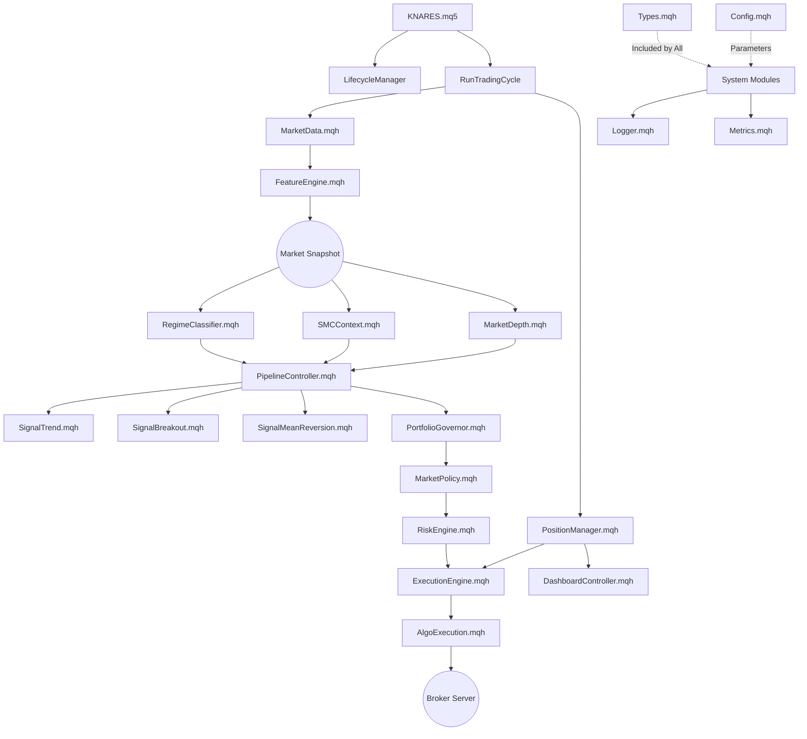

# KNARES MT5: System Architecture & File Relationships
**Knowledge-Navigator Expert Advisor Deep-Dive Documentation**

เอกสารฉบับนี้อธิบายความสัมพันธ์เชิงโครงสร้าง (Architecture) และบทบาทหน้าที่ของทุกไฟล์ในระบบ **KNARES MT5** อย่างละเอียด เพื่อให้เห็นภาพรวมการทำงานประสานกันของโมดูลต่างๆ

---

## 1. แผนผังลำดับชั้นของระบบ (System Layering)

ระบบ KNARES ถูกออกแบบมาเป็น 8 ชั้นหลักที่ทำงานประสานกันแบบ Pipeline:

1.  **Foundation Layer:** รากฐานข้อมูลและโครงสร้าง
2.  **Data & Sensor Layer:** การรับข้อมูลจากตลาดและข่าว
3.  **Analytical Layer:** การจำแนกสภาวะตลาดและโครงสร้างราคา
4.  **Strategy Layer:** กลยุทธ์การเทรด (Engines)
5.  **Brain (Decision) Layer:** การคัดกรองและตัดสินใจส่วนกลาง
6.  **Risk & Control Layer:** การตรวจสอบความปลอดภัยและคำนวณขนาดไม้
7.  **Execution Layer:** การส่งคำสั่งและการจัดการออเดอร์
8.  **Infrastructure Layer:** การแสดงผล, บันทึก Log และการจัดการระบบ

---

## 2. รายละเอียดไฟล์และความสัมพันธ์ (File Details & Inter-dependencies)

### ชั้นที่ 1: Foundation Layer (รากฐาน)
*   **`Types.mqh`**: **(The Blueprint)** กำหนด Structs และ Enums ทั้งหมด
    *   *ความสัมพันธ์:* ถูก Include ในทุกๆ ไฟล์เพื่อให้ทุกโมดูลเข้าใจโครงสร้างข้อมูลเดียวกัน
*   **`Config.mqh`**: **(The Controller)** เก็บพารามิเตอร์ Input จากผู้ใช้
    *   *ความสัมพันธ์:* ส่งค่าตั้งค่าไปยังทุกโมดูลเพื่อใช้เป็นเกณฑ์ (Thresholds) ในการตัดสินใจ
*   **`SMCInputs.mqh`**: แยกการตั้งค่าเฉพาะของ SMC ออกมาจาก Config หลัก
*   **`SharedGlobals.mqh`**: เก็บตัวแปรส่วนกลางที่แชร์กันระหว่างรันโปรแกรม เช่น Drawdown ปัจจุบัน

### ชั้นที่ 2: Data & Sensor Layer (การรับรู้)
*   **`MarketData.mqh`**: สร้าง `MarketSnapshot` โดยดึงข้อมูลราคา Bid/Ask/Spread
*   **`FeatureEngine.mqh`**: คำนวณอินดิเคเตอร์เทคนิคลดลงใน Snapshot
*   **`NewsConnector.mqh` & `NewsFilter.mqh`**: ดึงข้อมูลข่าวและระบุช่วงเวลาที่ควรระงับการเทรด
*   **`MarketDepth.mqh`**: วิเคราะห์ Order Book (DOM) เพื่อหาแรงซื้อขายแฝง

### ชั้นที่ 3: Analytical Layer (การวิเคราะห์เชิงลึก)
*   **`RegimeClassifier.mqh`**: **(The Analyst)** รับ Snapshot มาตัดสิน `ENUM_REGIME_TYPE` (สภาวะตลาด)
    *   *ความสัมพันธ์:* ส่งผลลัพธ์ให้ Pipeline เลือกกลยุทธ์ที่เหมาะสม
*   **`SMCContext.mqh`**: **(The Structuralist)** วิเคราะห์ BOS, CHoCH และ Premium/Discount
    *   *ความสัมพันธ์:* ให้คะแนน `quality` เพื่อใช้เป็นตัวคูณเพิ่มน้ำหนักสัญญาณใน Pipeline
*   **`RegimeForecaster.mqh`**: ใช้โมเดลทางสถิติ (HMM) พยากรณ์สภาวะตลาดล่วงหน้า

### ชั้นที่ 4: Strategy Layer (กลยุทธ์/เครื่องยนต์)
*   **`SignalTrend.mqh`**: กลยุทธ์ตามแนวโน้ม (Trend Following)
*   **`SignalBreakout.mqh`**: กลยุทธ์ราคาทะลุแนวรับแนวต้าน (Breakout)
*   **`SignalMeanReversion.mqh`**: กลยุทธ์สวนกลับหาค่าเฉลี่ย (Mean Reversion)
*   **`StatArbEngine.mqh`**: กลยุทธ์ Statistical Arbitrage (ส่วนต่างราคา)

### ชั้นที่ 5: Brain Layer (การตัดสินใจ)
*   **`EnsembleScorer.mqh`**: รวมสัญญาณจากหลายกลยุทธ์และให้คะแนนรวม (Ensemble)
*   **`PipelineController.mqh`**: **(The Brain)** ศูนย์กลางการตัดสินใจ
    *   *ความสัมพันธ์:* เรียกใช้โมดูลวิเคราะห์ (ชั้น 3) และโมดูลกลยุทธ์ (ชั้น 4) มาตัดสินใจร่วมกัน
*   **`SignalRescue.mqh`**: พยายามรักษาออเดอร์คุณภาพสูงที่มีคะแนนหมิ่นเหม่แต่บริบท SMC ดีมาก
*   **`DynamicThreshold.mqh`**: ปรับเกณฑ์คะแนนตามความผันผวนของตลาด

### ชั้นที่ 6: Risk & Control Layer (การควบคุมความปลอดภัย)
*   **`RiskEngine.mqh`**: คำนวณ Lot Size ตามความเสี่ยงและระยะ SL
*   **`PortfolioGovernor.mqh`**: **(The Safety Guard)** ตรวจสอบ Exposure และ Heat รวมของพอร์ต
*   **`MarketPolicy.mqh`**: ตรวจสอบกฎเหล็ก เช่น Price Clustering หรือ Stops Level
*   **`RiskAccounting.mqh`**: บันทึกงบประมาณความเสี่ยงที่ใช้ไปในแต่ละวัน
*   **`InstanceGuard.mqh`**: ป้องกันการเปิด EA ซ้ำซ้อน

### ชั้นที่ 7: Execution Layer (การปฏิบัติการ)
*   **`ExecutionEngine.mqh`**: ส่งคำสั่ง `OrderSend` เข้าสู่ตลาด
*   **`AlgoExecution.mqh`**: จัดการการส่งไม้แบบอัลกอริทึม (Iceberg/TWAP)
*   **`PositionManager.mqh`**: **(The Caretaker)** ดูแลออเดอร์ที่เปิดอยู่ (SL/TP/Partial/Regime Exit)
*   **`TradeTracking.mqh` & `TradeEventHandler.mqh`**: ติดตามและจัดการเหตุการณ์การเทรดแบบ Real-time

### ชั้นที่ 8: Infrastructure Layer (โครงสร้างสนับสนุน)
*   **`KNARES.mq5`**: **(The Core)** ไฟล์ทางเข้าหลักที่รวบรวมทุกโมดูลเข้าด้วยกัน
*   **`LifecycleManager.mqh`**: ควบคุมลำดับการ Init และ Deinit ของทั้งระบบ
*   **`DashboardController.mqh` & `Visualization.mqh`**: การแสดงผลกราฟิกและสถานะบนหน้าจอ
*   **`Logger.mqh` & `ReasonLogger.mqh`**: บันทึกการทำงานและเหตุผลที่ระบบไม่เทรด
*   **`Metrics.mqh` & `TradeJournal.mqh`**: สถิติพอร์ตและปูมการเทรดอย่างละเอียด
*   **`Diagnostics.mqh`**: ตรวจสอบสุขภาพของระบบ (Self-Health Check)
*   **`MathLib.mqh`**: ฟังก์ชันคณิตศาสตร์และสถิติพื้นฐาน

---

## 3. ลำดับการทำงาน (The Data Flow Journey)

เพื่อให้เห็นความสัมพันธ์ชัดเจน นี่คือสิ่งที่เกิดขึ้นใน 1 รอบของราคา (1 Tick):

1.  **Entry Point:** `KNARES.mq5` รับ Tick -> เรียก `RunTradingCycle`
2.  **Data Gathering:** `MarketData` + `FeatureEngine` เตรียม Snapshot
3.  **Analysis:** `RegimeClassifier` ตัดสินสภาวะตลาด | `SMCContext` วิเคราะห์โครงสร้างราคา
4.  **Signal Generation:** `PipelineController` เรียกกลยุทธ์ต่างๆ (Engines) มาสร้างสัญญาณ
5.  **Scoring:** `EnsembleScorer` และ `Pipeline` ทำการให้คะแนนและหักคะแนนตามความเหมาะสม
6.  **Safety Check:** `PortfolioGovernor` และ `MarketPolicy` ตรวจสอบว่า "อนุญาตให้เทรดหรือไม่"
7.  **Sizing:** `RiskEngine` คำนวณขนาด Lot ที่ปลอดภัยที่สุด
8.  **Execution:** `ExecutionEngine` ส่งคำสั่งไปโบรกเกอร์
9.  **Monitoring:** `PositionManager` ตรวจสอบออเดอร์เดิม และอัปเดตสถานะผ่าน `DashboardController`

---

## 4. ตารางสรุปการสื่อสารระหว่างไฟล์ (Inter-file Communication)

| ไฟล์ต้นทาง (Source) | ไฟล์ปลายทาง (Target) | สิ่งที่ส่งมอบ (Output) |
| :--- | :--- | :--- |
| `Types.mqh` | ทุุกไฟล์ | โครงสร้างข้อมูลพื้นฐาน |
| `MarketData` | `PipelineController` | `MarketSnapshot` ข้อมูลดิบ |
| `RegimeClassifier` | `PipelineController` | `ENUM_REGIME_TYPE` (สภาวะตลาด) |
| `SMCContext` | `PipelineController` | `SMC quality score` & Structural Data |
| `Signal Engines` | `PipelineController` | `SignalPack` (สัญญาณดิบ) |
| `PipelineController` | `RiskEngine` | `Final SignalPack` (สัญญาณที่ผ่านการกรอง) |
| `RiskEngine` | `ExecutionEngine` | `RiskDecision` (Lot size & SL/TP) |
| `ExecutionEngine` | `TradeTracking` | Ticket ID & Deal Data |
| `PositionManager` | `ExecutionEngine` | คำสั่ง Modify/Close |

---

## 5. Architectural Connection Diagram (แผนผังความเชื่อมโยงของระบบ)

ผังด้านล่างนี้แสดงการไหลของข้อมูลและการเรียกใช้โมดูลต่างๆ ตั้งแต่จุดเริ่มต้นจนถึงการประมวลผลขั้นสุดท้าย:

### 5.1 Visual Data Flow (Mermaid Diagram)



### 5.2 Text-Based Connection Map (ASCII Structure)

```text
[KNARES.mq5] (Entry Point)
   │
   ├── [LifecycleManager] ─── (Manages Init/Deinit sequence)
   │
   ├── [RunTradingCycle] (The Engine Loop)
   │    │
   │    ├─► [MarketData] + [FeatureEngine] ──► {MarketSnapshot}
   │    │    └─ (Prices, Spread, ATR, ADX, RSI, etc.)
   │    │
   │    ├─► [RegimeClassifier] ──► (Identifies Market State: Trend/Range/Shock)
   │    │
   │    ├─► [SMCContext] ──► (Analyses Structure: BOS, CHoCH, Premium/Discount)
   │    │
   │    ├─► [PipelineController] (Decision Brain)
   │    │    │
   │    │    ├── [SignalTrend] / [SignalBreakout] / [SignalMeanRev]
   │    │    ├── [EnsembleScorer] (Merges signals)
   │    │    └── [SignalRescue] (Attempts to recover high-quality setups)
   │    │
   │    ├─► [PortfolioGovernor] ──► (Checks: Exposure, Heat, Cluster, MaxPos)
   │    │
   │    ├─► [RiskEngine] ──► (Calculates: Dynamic Lots, SL/TP levels)
   │    │
   │    ├─► [ExecutionEngine] ──► [AlgoExecution] ──► (ORDER SEND)
   │    │
   │    └─► [PositionManager] (The Caretaker)
   │         ├── (Trailing Stops, Partial Profits)
   │         └── (Regime Exits, Early Invalidation)
   │
   └── [Infrastructure Support]
        ├── [Logger] / [ReasonLogger] (System Tracking)
        ├── [DashboardController] / [Visualization] (GUI)
        └── [Metrics] / [TradeJournal] (Performance Data)

[Types.mqh] & [Config.mqh] ◄────── (Cross-cutting Foundation for ALL files)
```

---
**Copyright 2026, Dr.Kittimasak Naijit**
*KNARES Architectural Blueprint - Version 1.0*

